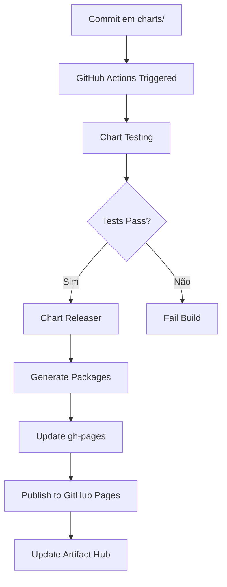

# 📚 Documentação - Publicação de Helm Charts

Esta documentação detalha o processo completo para criação, empacotamento e publicação de Helm Charts no repositório Tech-Preta/charts.

## 📋 Índice

- [Pré-requisitos](#-pré-requisitos)
- [Estrutura do Projeto](#-estrutura-do-projeto)
- [Criação de Charts](#-criação-de-charts)
- [Empacotamento](#-empacotamento)
- [Publicação](#-publicação)
- [CI/CD Automático](#-cicd-automático)
- [Troubleshooting](#-troubleshooting)

## ⚡ Pré-requisitos

### Ferramentas Necessárias

```bash
# Helm 3.x
helm version

# Git
git --version

# Kubectl (para testes)
kubectl version --client

# Chart Testing (opcional, para testes locais)
ct version
```

### Permissões Necessárias

- ✅ Acesso de escrita ao repositório `Tech-Preta/charts`
- ✅ GitHub Pages habilitado
- ✅ GitHub Actions configurado
- ✅ Token de acesso (para releases automáticos)

## 🏗️ Estrutura do Projeto

```
charts/
├── .github/
│   ├── workflows/
│   │   ├── chart-testing.yml      # Testes automatizados
│   │   ├── release.yml            # Release automático
│   │   └── markdown-linter.yml    # Lint de documentação
│   ├── configs/
│   │   ├── cr.yaml               # Chart Releaser config
│   │   └── ct.yaml               # Chart Testing config
│   └── ISSUE_TEMPLATE/           # Templates de issues
├── charts/
│   ├── chart-name/
│   │   ├── Chart.yaml            # Metadados do chart
│   │   ├── values.yaml           # Valores padrão
│   │   ├── README.md             # Documentação
│   │   └── templates/            # Templates Kubernetes
│   └── ...
├── docs/                         # Documentação do projeto
├── *.tgz                        # Charts empacotados
├── index.yaml                   # Índice do repositório Helm
└── README.md                    # Documentação principal
```

## 🎯 Criação de Charts

### 1. Criar Novo Chart

```bash
# Navegar para o diretório de charts
cd charts/

# Criar estrutura básica do chart
helm create meu-novo-chart

# Ou copiar de um chart existente
cp -r chart-existente/ meu-novo-chart/
```

### 2. Configurar Chart.yaml

```yaml
apiVersion: v2
name: meu-chart
description: Descrição detalhada do chart
version: 0.1.0
appVersion: "1.0.0"
type: application

keywords:
  - palavra-chave1
  - palavra-chave2

maintainers:
  - name: Natália Granato
    email: contato@nataliagranato.xyz
    url: https://github.com/nataliagranato

home: https://github.com/Tech-Preta/charts
sources:
  - https://github.com/projeto/fonte

icon: https://exemplo.com/icon.png

# Dependências (se houver)
dependencies:
  - name: redis
    version: "17.x.x"
    repository: "https://charts.bitnami.com/bitnami"
    condition: redis.enabled
```

### 3. Configurar values.yaml

```yaml
# Configurações da aplicação
image:
  repository: nginx
  tag: "1.21"
  pullPolicy: IfNotPresent

replicaCount: 1

service:
  type: ClusterIP
  port: 80

ingress:
  enabled: false
  className: ""
  annotations: {}
  hosts:
    - host: chart-example.local
      paths:
        - path: /
          pathType: Prefix
  tls: []

resources:
  limits:
    cpu: 100m
    memory: 128Mi
  requests:
    cpu: 100m
    memory: 128Mi

autoscaling:
  enabled: false
  minReplicas: 1
  maxReplicas: 100
  targetCPUUtilizationPercentage: 80

nodeSelector: {}
tolerations: []
affinity: {}
```

### 4. Criar Templates

#### deployment.yaml
```yaml
apiVersion: apps/v1
kind: Deployment
metadata:
  name: {{ include "meu-chart.fullname" . }}
  labels:
    {{- include "meu-chart.labels" . | nindent 4 }}
spec:
  {{- if not .Values.autoscaling.enabled }}
  replicas: {{ .Values.replicaCount }}
  {{- end }}
  selector:
    matchLabels:
      {{- include "meu-chart.selectorLabels" . | nindent 6 }}
  template:
    metadata:
      annotations:
        checksum/config: {{ include (print $.Template.BasePath "/configmap.yaml") . | sha256sum }}
      labels:
        {{- include "meu-chart.selectorLabels" . | nindent 8 }}
    spec:
      serviceAccountName: {{ include "meu-chart.serviceAccountName" . }}
      containers:
        - name: {{ .Chart.Name }}
          image: "{{ .Values.image.repository }}:{{ .Values.image.tag | default .Chart.AppVersion }}"
          imagePullPolicy: {{ .Values.image.pullPolicy }}
          ports:
            - name: http
              containerPort: 80
              protocol: TCP
          livenessProbe:
            httpGet:
              path: /
              port: http
          readinessProbe:
            httpGet:
              path: /
              port: http
          resources:
            {{- toYaml .Values.resources | nindent 12 }}
```

### 5. Criar Testes

```yaml
# templates/tests/test-connection.yaml
apiVersion: v1
kind: Pod
metadata:
  name: "{{ include "meu-chart.fullname" . }}-test"
  labels:
    {{- include "meu-chart.labels" . | nindent 4 }}
  annotations:
    "helm.sh/hook": test
spec:
  restartPolicy: Never
  containers:
    - name: wget
      image: busybox
      command: ['wget']
      args: ['{{ include "meu-chart.fullname" . }}:{{ .Values.service.port }}']
```

### 6. Documentação (README.md)

```markdown
# Meu Chart

Descrição detalhada do chart.

## Instalação

```bash
helm repo add techpreta https://tech-preta.github.io/charts/
helm install meu-release techpreta/meu-chart
```

## Configuração

| Parâmetro | Descrição | Padrão |
|-----------|-----------|---------|
| `image.repository` | Repositório da imagem | `nginx` |
| `image.tag` | Tag da imagem | `1.21` |
| `replicaCount` | Número de réplicas | `1` |

## Exemplos

### Instalação básica
```bash
helm install meu-chart techpreta/meu-chart
```

### Com valores customizados
```bash
helm install meu-chart techpreta/meu-chart \
  --set image.tag=1.22 \
  --set replicaCount=3
```
```

## 📦 Empacotamento

### 1. Validar Chart

```bash
# Lint do chart
helm lint charts/meu-chart/

# Verificar templates
helm template meu-chart charts/meu-chart/ --debug --dry-run

# Testar instalação
helm install test-release charts/meu-chart/ --dry-run --debug
```

### 2. Gerar Package

```bash
# Navegar para o diretório raiz
cd /workspaces/charts

# Empacotar chart individual
helm package charts/meu-chart/ --destination .

# Empacotar todos os charts
for chart in charts/*/; do
  if [ -f "$chart/Chart.yaml" ]; then
    helm package "$chart" --destination .
  fi
done
```

### 3. Atualizar Index

```bash
# Gerar/atualizar index.yaml
helm repo index . --url https://tech-preta.github.io/charts/

# Ou fazer merge com index existente
helm repo index . --url https://tech-preta.github.io/charts/ --merge index.yaml
```

### 4. Validar Packages

```bash
# Testar package gerado
helm template test meu-chart-0.1.0.tgz --dry-run > /dev/null

# Verificar conteúdo do package
tar -tzf meu-chart-0.1.0.tgz

# Validar index.yaml
helm repo index . --url https://tech-preta.github.io/charts/ --merge index.yaml
```

## 🚀 Publicação

### Publicação Manual

```bash
# 1. Commit das mudanças
git add .
git commit -m "feat: adiciona chart meu-chart v0.1.0"

# 2. Push para o repositório
git push origin main

# 3. GitHub Actions irá automaticamente:
#    - Executar testes
#    - Gerar packages
#    - Atualizar GitHub Pages
#    - Publicar no Artifact Hub
```

### Publicação Automática (Recomendada)

O repositório está configurado com GitHub Actions que automaticamente:

1. **Testa** os charts em PRs
2. **Empacota** charts quando há mudanças em `charts/`
3. **Publica** no GitHub Pages
4. **Atualiza** o Artifact Hub

#### Workflow de Testes (.github/workflows/chart-testing.yml)

```yaml
name: Chart Testing

on:
  push:
    branches: [ main ]
  pull_request:
    branches: [ main ]

jobs:
  lint-test:
    runs-on: ubuntu-latest
    steps:
      - name: Checkout
        uses: actions/checkout@v4
        with:
          fetch-depth: 0

      - name: Set up Helm
        uses: azure/setup-helm@v4

      - name: Set up chart-testing
        uses: helm/chart-testing-action@v2.6.1

      - name: Run chart-testing (lint)
        run: ct lint --target-branch main

      - name: Create kind cluster
        uses: helm/kind-action@v1.9.0

      - name: Run chart-testing (install)
        run: ct install --target-branch main
```

#### Workflow de Release (.github/workflows/release.yml)

```yaml
name: Release Charts

on:
  push:
    branches: [ main ]
    paths: [ 'charts/**' ]

jobs:
  release:
    runs-on: ubuntu-latest
    steps:
      - name: Checkout
        uses: actions/checkout@v4
        with:
          fetch-depth: 0

      - name: Configure Git
        run: |
          git config user.name "$GITHUB_ACTOR"
          git config user.email "$GITHUB_ACTOR@users.noreply.github.com"

      - name: Install Helm
        uses: azure/setup-helm@v4

      - name: Run chart-releaser
        uses: helm/chart-releaser-action@v1.6.0
        env:
          CR_TOKEN: "${{ secrets.USER_TOKEN }}"
```

## 🤖 CI/CD Automático

### Configuração Necessária

1. **Secrets do GitHub**
   ```
   USER_TOKEN: Token com permissões de escrita no repositório
   ```

2. **GitHub Pages**
   - Habilitado para o repositório
   - Source: gh-pages branch

3. **Artifact Hub** (Opcional)
   - Configuração automática via metadados

### Processo Automático



### Monitoramento

- ✅ **GitHub Actions**: Status dos workflows
- ✅ **GitHub Pages**: Status da publicação
- ✅ **Artifact Hub**: Sincronização automática

## 🔧 Troubleshooting

### Problemas Comuns

#### 1. Chart Lint Failures

```bash
# Erro: Chart.yaml inválido
Error: validation: chart.metadata is required

# Solução: Verificar Chart.yaml
helm lint charts/meu-chart/
```

#### 2. Template Errors

```bash
# Erro: Template inválido
Error: template: meu-chart/templates/deployment.yaml:10:14: 
executing "meu-chart/templates/deployment.yaml" at <.Values.image.tag>: 
nil pointer evaluating interface {}.tag

# Solução: Verificar values.yaml e templates
helm template test charts/meu-chart/ --debug
```

#### 3. Package Generation Issues

```bash
# Erro: Diretório não encontrado
Error: path "charts/meu-chart" not found

# Solução: Verificar estrutura de diretórios
ls -la charts/
```

#### 4. Index.yaml Corruption

```bash
# Regenerar index.yaml
rm index.yaml
helm repo index . --url https://tech-preta.github.io/charts/
```

### Comandos de Debug

```bash
# Verificar estrutura do chart
helm show chart charts/meu-chart/

# Verificar valores
helm show values charts/meu-chart/

# Verificar templates renderizados
helm template meu-chart charts/meu-chart/ --debug

# Verificar package
tar -tzf meu-chart-0.1.0.tgz

# Testar instalação local
helm install test charts/meu-chart/ --dry-run --debug
```

### Logs dos Workflows

```bash
# Verificar logs do GitHub Actions
# 1. Ir para: https://github.com/Tech-Preta/charts/actions
# 2. Selecionar o workflow com falha
# 3. Revisar logs detalhados
```

## 📚 Recursos Adicionais

- [Helm Documentation](https://helm.sh/docs/)
- [Chart Best Practices](https://helm.sh/docs/chart_best_practices/)
- [Chart Testing](https://github.com/helm/chart-testing)
- [Chart Releaser](https://github.com/helm/chart-releaser)
- [Artifact Hub](https://artifacthub.io/)

---

Desenvolvido com ❤️ pela [Tech-Preta](https://github.com/Tech-Preta)
