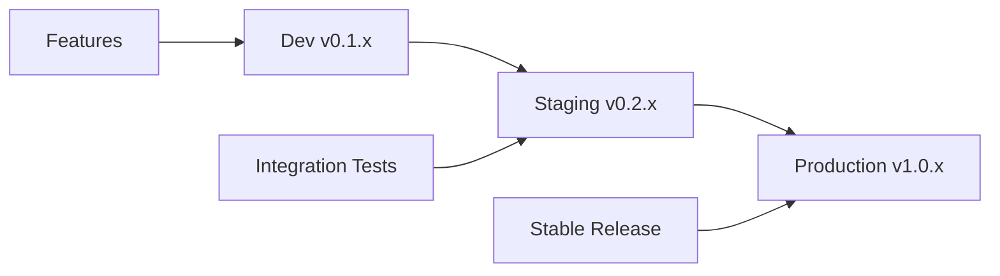

# 🏷️ Guia de Versionamento de Helm Charts

Este documento define as práticas de versionamento para os Helm Charts do repositório Tech-Preta/charts.

## 📋 Índice

- [Estratégia de Versionamento](#-estratégia-de-versionamento)
- [Semantic Versioning](#-semantic-versioning)
- [Versionamento de Charts vs Apps](#-versionamento-de-charts-vs-apps)
- [Ambientes e Versões](#-ambientes-e-versões)
- [Processo de Release](#-processo-de-release)
- [Exemplos Práticos](#-exemplos-práticos)

## 🎯 Estratégia de Versionamento

### Semantic Versioning (SemVer)

Seguimos o padrão [Semantic Versioning 2.0.0](https://semver.org/) para todos os charts:

```
MAJOR.MINOR.PATCH
```

- **MAJOR**: Mudanças incompatíveis com versões anteriores
- **MINOR**: Novas funcionalidades mantendo compatibilidade
- **PATCH**: Correções de bugs mantendo compatibilidade

### Versionamento Dual

Cada chart possui duas versões independentes:

1. **Chart Version** (`version`): Versão do próprio chart
2. **App Version** (`appVersion`): Versão da aplicação que o chart instala

```yaml
# Chart.yaml
apiVersion: v2
name: meu-chart
version: 1.2.3      # Versão do chart
appVersion: "2.1.0" # Versão da aplicação
```

## 🔄 Semantic Versioning

### MAJOR (x.0.0)

Incremente quando houver:

- ✅ **Breaking changes** em valores do `values.yaml`
- ✅ **Remoção** de recursos ou funcionalidades
- ✅ **Mudanças incompatíveis** na API do Kubernetes
- ✅ **Alterações** que quebram instalações existentes

**Exemplo:**
```yaml
# v1.x.x
values:
  database:
    host: localhost
    port: 5432

# v2.0.0 - Breaking change
values:
  database:
    connection:
      host: localhost
      port: 5432
```

### MINOR (x.y.0)

Incremente quando houver:

- ✅ **Novas funcionalidades** opcionais
- ✅ **Novos valores** no `values.yaml` (com defaults)
- ✅ **Melhorias** que mantêm compatibilidade
- ✅ **Novos recursos** opcionais do Kubernetes

**Exemplo:**
```yaml
# v1.1.0 - Nova funcionalidade
values:
  monitoring:
    enabled: false  # Novo recurso opcional
    serviceMonitor:
      enabled: false
```

### PATCH (x.y.z)

Incremente quando houver:

- ✅ **Correções de bugs**
- ✅ **Atualizações de documentação**
- ✅ **Melhorias internas** sem impacto na API
- ✅ **Correções de segurança**

**Exemplo:**
```yaml
# v1.1.1 - Correção de bug
# Corrigido: resource limits não sendo aplicados corretamente
```

## 📊 Versionamento de Charts vs Apps

### Chart Version

Controla a evolução do próprio chart:

```yaml
# Chart.yaml
version: 1.2.3  # Versão do chart
```

**Quando incrementar:**
- Mudanças nos templates
- Modificações no values.yaml
- Atualizações na documentação
- Correções de bugs no chart

### App Version

Representa a versão da aplicação empacotada:

```yaml
# Chart.yaml
appVersion: "2.1.0"  # Versão da aplicação
```

**Quando incrementar:**
- Nova versão da aplicação disponível
- Atualização da imagem Docker
- Mudança na versão da aplicação principal

### Matriz de Compatibilidade

| Chart Version | App Version | Kubernetes | Helm |
|---------------|-------------|------------|------|
| 1.0.x         | 1.x.x      | 1.19+      | 3.0+ |
| 1.1.x         | 1.x.x      | 1.20+      | 3.2+ |
| 2.0.x         | 2.x.x      | 1.21+      | 3.5+ |

## 🌍 Ambientes e Versões

### Estratégia por Ambiente

```
charts/
├── giropops-senhas-dev/     # v0.1.x (experimental)
├── giropops-senhas-stg/     # v0.2.x (staging)
└── giropops-senhas-prd/     # v1.0.x (produção)
```

### Fluxo de Promoção



### Versionamento por Ambiente

#### Desenvolvimento (dev)
- **Range**: `0.1.x`
- **Propósito**: Experimentação e desenvolvimento
- **Estabilidade**: Instável
- **Breaking Changes**: Permitidos

```yaml
# charts/giropops-senhas-dev/Chart.yaml
version: 0.1.5
appVersion: "1.16.0-dev"
```

#### Staging (stg)
- **Range**: `0.2.x`
- **Propósito**: Testes de integração
- **Estabilidade**: Beta
- **Breaking Changes**: Com cuidado

```yaml
# charts/giropops-senhas-stg/Chart.yaml
version: 0.2.1
appVersion: "1.16.0-rc1"
```

#### Produção (prd)
- **Range**: `1.x.x`
- **Propósito**: Ambiente de produção
- **Estabilidade**: Estável
- **Breaking Changes**: Evitados

```yaml
# charts/giropops-senhas-prd/Chart.yaml
version: 1.0.0
appVersion: "1.16.0"
```

## 🚀 Processo de Release

### 1. Preparação

```bash
# Verificar mudanças
git diff HEAD~1 charts/meu-chart/

# Determinar tipo de mudança
# - Breaking change? → MAJOR
# - Nova feature? → MINOR
# - Bug fix? → PATCH
```

### 2. Atualização de Versão

```bash
# Editar Chart.yaml
vim charts/meu-chart/Chart.yaml

# Exemplo de incremento MINOR
version: 1.2.0  # era 1.1.5
appVersion: "2.1.0"  # atualizada também
```

### 3. Changelog

```markdown
# CHANGELOG.md

## [1.2.0] - 2025-09-04

### Added
- Nova funcionalidade de monitoramento
- Suporte para ServiceMonitor
- Configuração de alertas

### Changed
- Melhorado template de deployment
- Atualizada documentação

### Fixed
- Corrigido problema com probes de saúde
```

### 4. Teste e Validação

```bash
# Lint do chart
helm lint charts/meu-chart/

# Teste de template
helm template test charts/meu-chart/ --debug

# Teste de instalação
helm install test charts/meu-chart/ --dry-run
```

### 5. Release

```bash
# Commit das mudanças
git add .
git commit -m "release: meu-chart v1.2.0"

# Tag de release (opcional)
git tag meu-chart-v1.2.0

# Push
git push origin main
git push --tags
```

## 📝 Exemplos Práticos

### Exemplo 1: Correção de Bug

**Situação**: Corrigir erro em template de service

```yaml
# Antes (v1.1.3)
# Bug: porta errada no service

# Depois (v1.1.4)
version: 1.1.4  # PATCH increment
appVersion: "2.0.1"  # Mantém app version
```

### Exemplo 2: Nova Funcionalidade

**Situação**: Adicionar suporte para Ingress

```yaml
# Antes (v1.1.4)
# Não tinha suporte para Ingress

# Depois (v1.2.0)
version: 1.2.0  # MINOR increment
appVersion: "2.0.1"  # Mantém app version
```

**values.yaml**:
```yaml
# Nova seção adicionada
ingress:
  enabled: false  # Default compatível
  className: ""
  annotations: {}
```

### Exemplo 3: Breaking Change

**Situação**: Reestruturar configuração de database

```yaml
# Antes (v1.2.3)
database:
  host: localhost
  port: 5432
  name: mydb

# Depois (v2.0.0)
version: 2.0.0  # MAJOR increment
appVersion: "2.1.0"
```

**values.yaml**:
```yaml
# Breaking change na estrutura
database:
  connection:
    host: localhost
    port: 5432
  config:
    name: mydb
    ssl: true
```

### Exemplo 4: Atualização de App

**Situação**: Nova versão da aplicação disponível

```yaml
# Antes
version: 1.2.3
appVersion: "2.0.1"

# Depois
version: 1.2.4  # PATCH: apenas app version mudou
appVersion: "2.0.2"  # Nova versão da app
```

## 🏷️ Tags e Releases

### Estratégia de Tags

```bash
# Tag por chart
git tag rundeck-exporter-v0.1.8
git tag giropops-senhas-dev-v0.1.0
git tag giropops-senhas-prd-v1.0.0

# Release geral (opcional)
git tag v2025.09.04
```

### Releases Automáticos

O GitHub Actions cria releases automaticamente:

```yaml
# .github/workflows/release.yml
- name: Create Release
  uses: helm/chart-releaser-action@v1.6.0
  env:
    CR_TOKEN: "${{ secrets.USER_TOKEN }}"
```

## 📋 Checklist de Release

### Antes do Release

- [ ] Versão incrementada corretamente
- [ ] CHANGELOG.md atualizado
- [ ] Documentação atualizada
- [ ] Testes passando
- [ ] Lint sem erros
- [ ] Breaking changes documentados

### Durante o Release

- [ ] Commit com mensagem clara
- [ ] Tag criada (se necessário)
- [ ] Push realizado
- [ ] GitHub Actions executando
- [ ] Charts empacotados
- [ ] Index.yaml atualizado

### Após o Release

- [ ] Verificar GitHub Pages
- [ ] Testar instalação
- [ ] Artifact Hub atualizado
- [ ] Documentação publicada
- [ ] Comunicar breaking changes

---

Desenvolvido com ❤️ pela [Tech-Preta](https://github.com/Tech-Preta)
